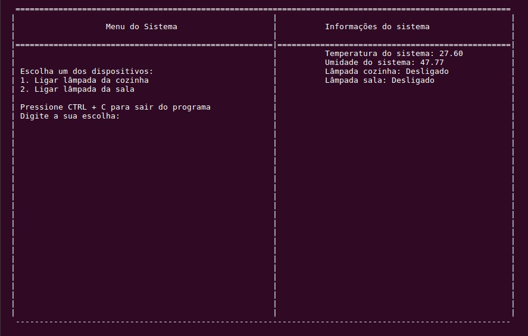
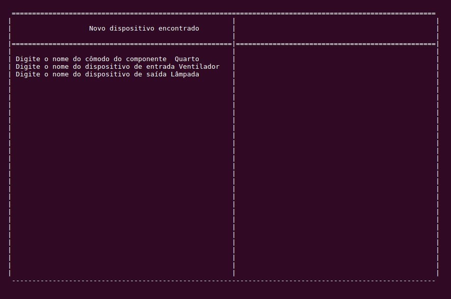
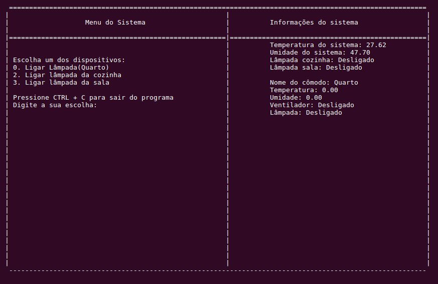
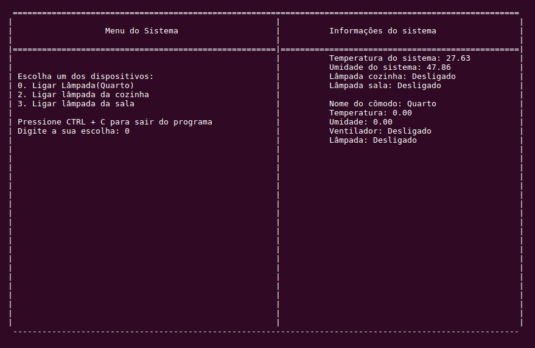
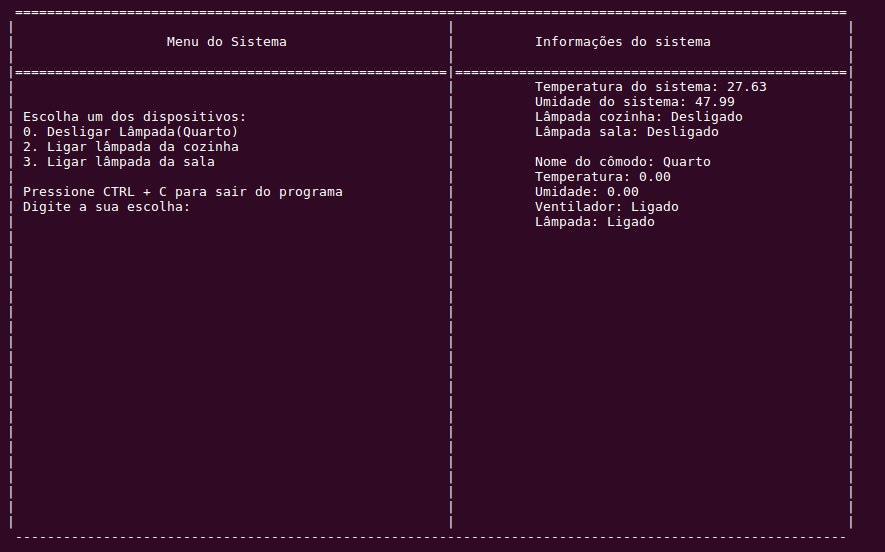
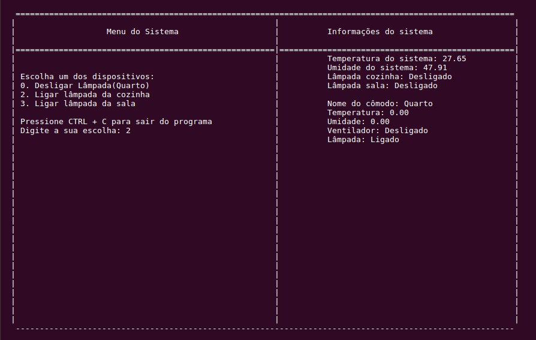
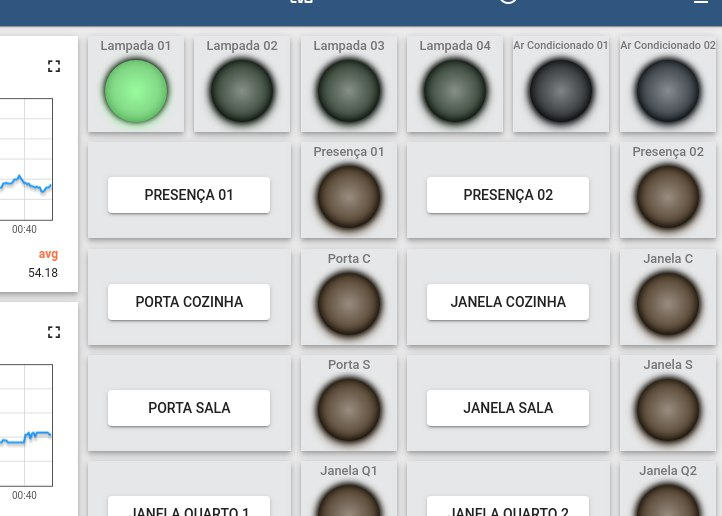

# Trabalho Final Fundamentos de Sistemas Embarcados

O objetivo deste trabalho é criar um sistema distribuído de automação residencial utilizando como sistema computacional central uma placa Raspberry Pi 4 e como controladores distribuídos placas ESP32, interconectados via Wifi através do protocolo MQTT.

# Requisitos 

## Servidor Central:

* O código do Servidor Central pode ser desenvolvido em Python, C ou C++;
* Prover uma interface que mantenha o usuário atualizado sobre o estado de cada dispositivo (atualizado a cada 1 segundo), incluindo a temperatura e umidade de cada cômodo;
* Prover mecanismo para que o usuário possa acionar manualmente todos os dispositivos controláveis (lâmpadas, aparelhos de ar-condicionado, etc.)
* Prover mecanismo para ligar e desligar o sistema de alarma que, quando ligado, deve tocar um som de alerta ao detectar presenças ou abertura de portas/janelas;
* Prover suporte para adicionar novos clientes ESP (até 5 clientes) cujas funções do botão e led representarão entradas (sensores de presença/porta/janelas ou interruptores) e saídas (acionamento de lâmpadas, tomadas, etc). Cada entrada/saída deve ser nomeada pelo usuário no momento da adição do dispositivo ESP.
* A adição de um novo dispositivo será realizada assim que a ESP se conectar à rede Wifi e enviar uma mensagem inicial de configuração para o tópico fse2020/<matricula>/dispositivos/<ID_do_dispositivo>. Neste caso, na tela do Servidor Central deve aparecer o novo dispositivo a ser adicionado onde, através de um comando, deverá ser possível definir:

   * O cômodo da casa onde o dispositivo estará alocado e que irá definir o nome do tópico onde o mesmo irá publicar suas mensagens (Obs: o nome do tópico não pode conter espaços ou caracteres especiais - preferencialmente manter somente com letras sem acentos e números);
   * O nome do dispositivo de Entrada e Saída sendo controlados por ele;
   * Ao final da configuração, sede ser enviada uma mensagem à ESP informando o nome do tópico/cômodo ao qual ela deverá, a partir deste momento enviar a mensagem com o estado dos dispositivos que controla;

* Manter log (Em arqvuio CSV) dos comandos acionados pelos usuários e do acionamento dos alarmes;

## Cliente ESP32:

* O código da ESP32 deve ser desenvolvido em C utilizando o framework ESP-IDF;
* A ESP32 deverá se conectar via Wifi (com as credenciais sendo definidas em variável de ambiente pelo Menuconfig);

* O cliente deve, ao iniciar pela primeira vez, deve: 
   * 3.1 Enviar uma mensagem MQTT de inicialização para o tópico fse2020/<matricula>/dispositivos/<ID_do_dispositivo> e se inscrever no mesmo tópico. Esse será o canal de comunicação de retorno do servidor central.
   * 3.2 Em seguida, o servidor central irá enviar uma mensagem de retorno (JSON) informando o nome do cômodo ao qual o dispositivo foi associado (que será o nome do tópico ao qual o mesmo irá publicar as informações sobre o estado de seus sensores). O formato deste tópico será: fse2020/<matricula>/<comodo>.
   * A partir deste momento, cada mudança de estado nos dispositivos controlados pela ESP deve ser publicado nos seguintes tópicos:
        * fse2020/<matricula>/<comodo>/temperatura  
        * fse2020/<matricula>/<comodo>/umidade
        * fse2020/<matricula>/<comodo>/estado

* Caso a ESP já tenho sido cadastrada no servidor central, deve guardar esta informação em sua memória não volátil (NVS) e, caso seja reiniciada, deve manter o estado anterior e não precisar se cadastrar novamente.

* Realizar a leitura da temperatura e umidade à partir do sensor DHT11 e enviar seu valor para o servidor central a cada 30 segundos;

* Monitorar o botão utilizando interrupções e enviar por mensagem push a cada mudança do estado do botão;

* Acionar o LED (Saída) à partir dos comandos enviados pelo servidor central pelo canal;

# Requisitos atendidos 
## Servidor Central

* Interface (linha de comando) apresentando o estado de cada dispositivo, temperaturas e umidades
* Mecanismo para acionamento dos dispositivos;

## Cliente ESP32

* Leitura e envio dos valores de temperatura / umidade a cada 1 segundo;
* Correto acionamento e envio do estado da saída de acordo com os comandos do servidor Central;
* Correta detecção e envio do estado da entrada ao servidor central;

## Geral 

* Correta implementação de comunicação entre os dispositivos;
* Correta implementação do mecanismo de adição de clientes ESP32 tanto no servidor quanto a configuração do Cliente;

# Como utilizar 

Para utilizar o sistema é preciso: 

## Para o Cliente 

0. Entrar na pasta CLIENT
1. Configurar as credenciais de wifi no menuconfig através do idf.py menuconfig
2. Transferir o código para a ESP32

## Para o servidor

1. Transferir a pasta CENTRAL_SERVER para a raspberry 
2. Entrar na pasta e executar make
3. Ainda na raiz da pasta executar ./central_server

## Fluxo de funcionamento

1. Ao transferir o código pra esp ela irá enviar uma mensagem para a rasp solicitando o cadastro do dispositivo
2. Na rasp, no terminal será possível cadastrar o nome do cômodo e dos dispositivos e, a partir de então a rasp receberá os valores coletados pelo sensor DHT11
3. O usuário poderá ligar ou desligar os dispositivos do cômodo;
4. O usuário receberá o estado do dispositivo de entrada, o botão da esp através da interface da rasp
5. O usuário poderá acompanhar o estado dos dispositivos na interface da rasp

# Exemplo de funcionamento

As lâmpadas da cozinha e sala são da rasp e pode ser acompanhado por meio do dashboard: 

* Obs. O sensor DHT11 dos dois componentes estão com problema, por esse motivo apresenta temperatura e umidade 0 (Envia -1)